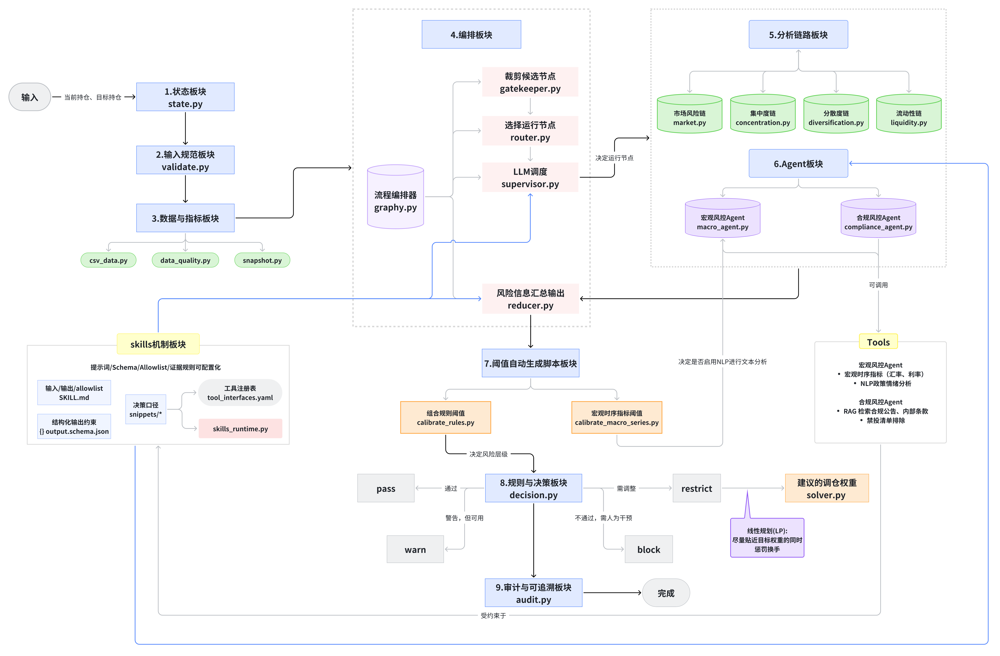

<div align="center">

# 🛡️ Risk-MAS

**基于多智能体系统的 ETF 投资组合风控框架**

[](https://www.python.org/)
[](https://github.com/langchain-ai/langgraph)
[](LICENSE)

*基于 LangChain、LangGraph 构建的 ETF 风控多智能体系统（MAS），覆盖输入规范化、指标快照、编排调度与结论输出，支持接入宏观时序与政策、合规文本数据，产出可审计的风险结论与调仓建议。*

</div>

---

## 📑 目录索引

- [🛡️ Risk-MAS](#️-risk-mas)
  - [📑 目录索引](#-目录索引)
  - [📖 项目简介](#-项目简介)
    - [设计理念](#设计理念)
  - [✨ 核心特性](#-核心特性)
  - [🏗️ 系统架构](#️-系统架构)
    - [架构概览](#架构概览)
    - [工作流程](#工作流程)
    - [核心组件](#核心组件)
      - [分析节点说明](#分析节点说明)
      - [决策等级](#决策等级)
  - [🚀 快速开始](#-快速开始)
    - [环境要求](#环境要求)
    - [安装步骤](#安装步骤)
    - [配置说明](#配置说明)
    - [运行方式](#运行方式)
  - [📘 使用指南](#-使用指南)
    - [API 调用](#api-调用)
    - [输入参数](#输入参数)
      - [Intent（交易意图）](#intent交易意图)
      - [Context（组合上下文）](#context组合上下文)
      - [RiskMAS 构造参数](#riskmas-构造参数)
    - [输出示例](#输出示例)
  - [⚙️ 配置详解](#️-配置详解)
    - [asof\_date 取值规则](#asof_date-取值规则)
    - [环境变量](#环境变量)
      - [数据与采样](#数据与采样)
      - [宏观时序](#宏观时序)
      - [合规文本 / RAG](#合规文本--rag)
      - [组合执行与 LP](#组合执行与-lp)
    - [规则阈值](#规则阈值)
      - [rules.yaml（组合规则阈值）](#rulesyaml组合规则阈值)
      - [macro\_series.yaml（宏观阈值配置）](#macro_seriesyaml宏观阈值配置)
    - [Skills 体系](#skills-体系)
  - [📁 项目结构](#-项目结构)
  - [🔄 迁移指南](#-迁移指南)
    - [1. 数据源与字段对齐](#1-数据源与字段对齐)
    - [2. 阈值与校准](#2-阈值与校准)
    - [3. Skills 与工具权限](#3-skills-与工具权限)
    - [4. 审计与输出](#4-审计与输出)
  - [❓ 常见问题](#-常见问题)

---

## 📖 项目简介

Risk-MAS 是一个专为 ETF 投资组合设计的智能风控系统，采用多智能体架构（Multi-Agent System），将复杂的风控任务分解为多个专业化的分析模块，通过 LangGraph 实现高效的并行执行与智能调度。

### 设计理念

| 理念 | 说明 |
|:---:|:---|
| **确定性优先** | 硬规则检查优先于 LLM 判断，确保关键风控逻辑的可靠性 |
| **并行高效** | 6 个分析节点真正并行执行，大幅提升处理效率 |
| **可审计追溯** | 完整的审计日志，所有决策都有据可查 |
| **灵活可配** | Skills 体系支持提示词、输出结构的热配置 |

---

## 🎓 学习路径

**本项目定位为 MAS 教学项目**，提供完整的学习资源：

| 资源 | 说明 | 适合人群 |
|:---:|:---|:---|
| **📘 [PRACTICE.md](PRACTICE.md)** | 10个模块的实战练习，包含代码模板和测试检查 | 学习者：通过实践掌握 MAS 架构 |
| **📐 [框架图说明_v2.md](框架图说明_v2.md)** | 详细的架构文档，包含数据流图和模块交互说明 | 开发者：深入理解系统设计 |
| **📖 README.md** | 快速入门和使用指南 | 用户：快速上手使用系统 |

> 💡 **推荐学习路径**：先阅读 README 了解系统 → 查看框架图说明理解架构 → 使用 PRACTICE.md 动手实践

---

## ✨ 核心特性

```
┌─────────────────────────────────────────────────────────────────┐
│                        Risk-MAS 核心特性                         │
├─────────────────────────────────────────────────────────────────┤
│  🔄 并行执行      基于 LangGraph Send API 实现 6 节点真正并行        │
│  📊 显式状态      TypedDict 定义的 RiskState，类型安全可追溯         │
│  🔗 混合架构      4 条确定性链 + 2 个 LLM 智能代理                   │
│  🛠️ 工具白名单    严格控制 LLM 可调用的工具范围，线程安全               │
│  ⚖️ 智能决策      硬规则优先 + 风险报告兜底，输出调仓建议               │
│  📝 Skills 体系   提示词/输出结构/证据规则可配置化                    │
│  🔍 审计追溯      完整记录决策过程，支持复现与对账                     │
│  🧮 约束求解      CVXPY 生成满足约束的最优调仓方案                    │
└─────────────────────────────────────────────────────────────────┘
```

---

## 🏗️ 系统架构

### 架构概览



### 工作流程

系统采用 DAG（有向无环图）编排，工作流程如下：

```
+--------------------------------------------------------------------------+
|                              INPUT LAYER                                 |
|                       Intent + Context (Portfolio)                       |
+------------------------------------+-------------------------------------+
                                     |
                                     v
+--------------------------------------------------------------------------+
|                           PRE-PROCESS PIPELINE                           |
|  +----------+   +--------------+   +----------+   +----------------+     |
|  | Validate | > | Data Quality | > | Snapshot | > |   Gatekeeper   |     |
|  +----------+   +--------------+   +----------+   +----------------+     |
+------------------------------------+-------------------------------------+
                                     |
                                     v
+--------------------------------------------------------------------------+
|                        SUPERVISOR (LLM Router)                           |
|         Selects nodes to run from candidates based on business logic     |
+------------------------------------+-------------------------------------+
                                     |
                                     v
+--------------------------------------------------------------------------+
|                    PARALLEL ANALYSIS (6 Nodes Concurrent)                |
|  +--------+ +---------------+ +---------------+ +-----------+            |
|  | Market | | Concentration | |Diversification| | Liquidity |            |
|  +--------+ +---------------+ +---------------+ +-----------+            |
|  +------------------------+ +--------------------------------+           |
|  |     Macro (Agent)      | |       Compliance(Agent)        |           |
|  +------------------------+ +--------------------------------+           |
+------------------------------------+-------------------------------------+
                                     |
                                     v
+--------------------------------------------------------------------------+
|                          POST-PROCESS PIPELINE                           |
|  +---------+   +-------------+   +----------+   +--------+   +-------+   |
|  | Reducer | > | Constraints | > | Decision | > | Solver | > | Audit |   |
|  +---------+   +-------------+   +----------+   +--------+   +-------+   |
+------------------------------------+-------------------------------------+
                                     |
                                     v
+--------------------------------------------------------------------------+
|                             OUTPUT LAYER                                 |
|                Decision + Recommendations + Audit Trail                  |
+--------------------------------------------------------------------------+
```

<details>
<summary><b>📋 工作流程中文说明</b></summary>

| 阶段 | 英文名称 | 中文说明 | 关键节点 |
|:---:|:---|:---|:---|
| 1️⃣ | INPUT LAYER | **输入层** | 交易意图（Intent）+ 组合上下文（Context） |
| 2️⃣ | PRE-PROCESS PIPELINE | **预处理管道** | 验证 → 数据质量检查 → 指标快照 → 门控筛选 |
| 3️⃣ | SUPERVISOR | **智能调度器** | 基于业务逻辑从候选节点中选择需要运行的节点 |
| 4️⃣ | PARALLEL ANALYSIS | **并行分析层** | 6个风险分析节点并发执行（市场/集中度/分散度/流动性/宏观/合规） |
| 5️⃣ | POST-PROCESS PIPELINE | **后处理管道** | 汇总 → 约束评估 → 决策引擎 → 约束求解 → 审计日志 |
| 6️⃣ | OUTPUT LAYER | **输出层** | 决策结果 + 调仓建议 + 审计追踪 |

**关键特性：**
- ✅ **门控（Gatekeeper）**：基于数据可用性筛选候选节点
- ✅ **调度器（Supervisor）**：基于业务逻辑智能选择节点
- ✅ **并行执行**：使用 LangGraph Send API 实现真正的并行
- ✅ **约束求解**：restrict 决策时自动生成满足约束的调仓方案

</details>

### 核心组件

#### 分析节点说明

| 节点 | 类型 | 功能 | 关键指标 |
|:---:|:---:|:---|:---|
| **Market** | 确定性链 | 市场风险评估 | 组合波动率 |
| **Concentration** | 确定性链 | 集中度风险评估 | HHI 指数、最大权重 |
| **Diversification** | 确定性链 | 分散度风险评估 | 有效持仓数（1/HHI） |
| **Liquidity** | 确定性链 | 流动性风险评估 | 买卖价差、成交量 |
| **Macro** | LLM Agent | 宏观经济分析 | 利率、汇率、政策情绪 |
| **Compliance** | LLM Agent | 合规风险分析 | 禁投清单、政策合规 |

> ⚠️ **Compliance 节点约束**：要求先调用检索工具并在输出 evidence 中引用 `rag:doc[i]`（硬约束）。

#### 决策等级

| 等级 | Severity | 说明 |
|:---:|:---:|:---|
| **Pass** | 0 | 放行，无风险 |
| **Warn** | 1 | 预警，建议关注 |
| **Restrict** | 2 | 限制，需调整 |
| **Block** | 3 | 阻断，禁止执行 |

> 📐 **深入阅读**：查看 [框架图说明_v2.md](框架图说明_v2.md) 了解详细的架构设计、数据流图和模块间交互说明。

---

## 🚀 快速开始

### 环境要求

- Python 3.12+
- uv（推荐）或 pip

### 安装步骤

```bash
# 克隆项目
git clone <repository-url>
cd risk-mas

# 使用 uv 安装依赖（推荐）
uv sync

# 或使用 pip
pip install -e .
```

### 配置说明

配置统一由 `src/config.py` 读取环境变量；**大部分配置有默认值，可按需覆盖**，按需在项目根目录创建 `.env`：

| 变量名 | 变量说明 | 示例 |
|:---|:---|:---|
| `OPENAI_BASE_URL` | LLM 兼容接口地址 | `https://dashscope.aliyuncs.com/compatible-mode/v1` |
| `LLM_MODEL` | 模型名称（不填则不启用 LLM） | `qwen3-max` |
| `OPENAI_API_KEY` | LLM API Key | `sk-*****` |
| `ENABLE_SUPERVISOR` | 是否启用 LLM 调度 | `1` |
| `TUSHARE_TOKEN` | Tushare Token（不填则宏观节点不进入候选） | `your_token` |
| `CSV_DATA_DIR` | CSV 数据目录 | `cufel_practice_data` |
| `COMPLIANCE_RAG_SOURCE` | 合规文本库（文件名或路径） | `csrc_2025.csv` |
| `RAG_ENGINE` | 检索模式 | `vector` |

> 其余变量见「配置详解 → 环境变量」。

### 运行方式

**默认输出表格（推荐）：**
```bash
uv run --env-file .env -- python -u -m src.app
```

**输出 JSON：**
```bash
uv run --env-file .env -- python -u -m src.app -JSON --pretty
```

**关闭 LLM 调度器：**
```bash
ENABLE_SUPERVISOR=0 uv run --env-file .env -- python -u -m src.app
```

**运行测试：**
```bash
uv run --env-file .env -- python -u test.py
```

> 💡 `test.py` 会根据交易目标 ETF 的数量自动校准 `rules.yaml`

---

## 📘 使用指南

### API 调用

```python
from risk_mas import RiskMAS

# 初始化
mas = RiskMAS(output="table")

# 定义交易意图
intent = {
    "date": "2025-11-15",
    "mode": "target",
    "targets": {
        "159213": 0.25,
        "159959": 0.25,
        "511960": 0.20,
        "516310": 0.20,
        "561180": 0.10
    }
}

# 定义上下文
context = {
    "current_positions": {
        "159213": 0.20,
        "159959": 0.20,
        "511960": 0.20,
        "516310": 0.20,
        "561180": 0.20
    },
    "policy_profile": "default",
    "aum": 1000000.0
}

# 执行风控分析
result = mas.run(intent=intent, context=context)
print(result)
```

### 输入参数

#### Intent（交易意图）

| 字段 | 必填 | 类型 | 说明 |
|:---|:---:|:---:|:---|
| `date` | ✅ | string | 交易意图日期，格式 `YYYY-MM-DD` |
| `mode` | ✅ | string | `target`（目标权重）或 `delta`（增量调仓） |
| `targets` | ✅ | dict | 目标/增量权重，`{code: weight}` |

#### Context（组合上下文）

| 字段 | 必填 | 类型 | 说明 |
|:---|:---:|:---:|:---|
| `current_positions` | ❌ | dict | 当前持仓 `{code: weight}` |
| `current_positions_date` | ❌ | string | 当前持仓日期 |
| `universe` | ❌ | list | 候选 ETF 池 |
| `policy_profile` | ❌ | string | 风险偏好：`default` / `conservative` |
| `aum` | ❌ | float | 组合 AUM |
| `account_type` / `jurisdiction` | ❌ | string | 预留字段（用于将来分账户/分辖区规则） |

#### RiskMAS 构造参数

| 参数 | 默认值 | 说明 |
|:---|:---:|:---|
| `llm` | `None` | 可直接传入 LLM 实例（不传则按环境变量加载） |
| `output` | `table` | `table` 或 `json`，决定返回表格还是 JSON 字符串 |
| `pretty` | `False` | JSON 是否美化（带缩进/换行） |
| `use_env_llm` | `True` | 是否从环境变量读取 LLM 配置 |

<details>
<summary>📋 数据质量口径（点击展开）</summary>

| 口径 | 字段 | 说明 |
|:---|:---|:---|
| market | `missing_etf_master` / `missing_market` | ETF 主表缺失、行情缺失 |
| macro | `timeseries_available` | 是否具备宏观时序来源（`TUSHARE_TOKEN`） |
| macro | `text_available` | 是否具备宏观文本来源（CSV） |
| macro | `latest_date` / `freshness_days` / `freshness_status` | 新鲜度口径 |
| compliance | `text_available` | 合规文本是否可用 |
| positions | `freshness_days` | 当前持仓日期新鲜度 |

> 若宏观文本日期晚于 asof_date，会写入 `data_gaps` 为 block（防止未来信息泄露）

</details>

### 输出示例

<details>
<summary>📊 点击展开完整输出示例</summary>

```text
----------------+---------------------------------------------------------------------------------------
 KEY            | VALUE                                                                        
----------------+---------------------------------------------------------------------------------------
 decision       | restrict                                                                     
 recommendation | rebalance: 使用线性规划在约束下优化目标权重 | 159213=0.15906, 159959=0.42083, 511960=0.42011 
 llm_used       | True                                                                         
 llm_model      | qwen3-max                                                                    
 trace_id       | eadf0c3f8f9353c5                                                             
----------------+---------------------------------------------------------------------------------------

-----------------+----------+-------------------
 RISK            | SEVERITY | SUMMARY     
-----------------+----------+-------------------
 market          | 0        | 组合波动率处于目标范围 
 concentration   | 0        | 组合集中度在合理范围内 
 diversification | 0        | 分散度较好       
 liquidity       | 2        | 流动性较弱       
 compliance      | 0        | 未发现合规问题     
-----------------+----------+-------------------

---------------------------+------------------------------------------------------
 AUDIT                     | VALUE
---------------------------+------------------------------------------------------
 policy_profile            | default
 supervisor_result         | market,concentration,diversification,liquidity,compliance
 supervisor_rationale      | 组合集中度指标显示HHI上升、有效持仓数下降，且最大个股权重较高，需运行concentration和diversification节点深入分析；weighted_adv和max_adv_ratio提示流动性风险，需运行liquidity节点；market节点用于提供基础市场上下文；macro节点因宏观风险severity为0且无异常信号可跳过；compliance为合规必需节点，应保留。
 skills_used               | 3
 node_outputs              | 35
 tool_calls                | 3
 tool_errors               | 0
 compliance_blocklist_soft | none
 compliance_industry_hits  | none
---------------------------+------------------------------------------------------

--------------------------+-------------+------------+--------
 RULE_KEY                 | VALUE       | CURRENT    | STATUS 
--------------------------+-------------+------------+--------
 adv_restrict             | 7623.25713  | 5285.94543 | ⚠️     
 adv_warn                 | 13023.33612 | 5285.94543 | ⚠️     
 min_weighted_adv         | 7623.25713  | 5285.94543 | ⚠️     
 blocklist                | CCC         | none       | ✅      
 effective_n_restrict     | 1.44431     | 2.63929    | ✅      
 effective_n_warn         | 1.66426     | 2.63929    | ✅      
 hhi_restrict             | 0.69237     | 0.37889    | ✅      
 hhi_warn                 | 0.60087     | 0.37889    | ✅      
 max_hhi                  | 0.69237     | 0.37889    | ✅      
 max_portfolio_volatility | 0.01936     | 0.00681    | ✅      
 max_single_weight        | 0.81958     | 0.42083    | ✅      
 max_weighted_spread_bps  | 244.75162   | 91.02152   | ✅      
 spread_restrict          | 244.75162   | 91.02152   | ✅      
 spread_warn              | 225.26680   | 91.02152   | ✅      
 top_weight_restrict      | 0.81958     | 0.42083    | ✅      
 top_weight_warn          | 0.74373     | 0.42083    | ✅      
 volatility_restrict      | 0.01936     | 0.00681    | ✅      
 volatility_warn          | 0.01764     | 0.00681    | ✅      
--------------------------+-------------+------------+--------

------------+--------------+----------------------------------------+-----------------
 AGENT      | SUMMARY      | EVIDENCE                               | RECOMMENDATIONS 
------------+--------------+----------------------------------------+-----------------
 compliance | 未发现合规问题 | tool:compliance_blocklist              | 请复核合规规则         
 macro      | 未运行        | 原因来自 supervisor_rationale           | none            
------------+--------------+----------------------------------------+-----------------
```

合规节点（JSON 片段示例，含 `rag:doc[i]` 引用）：

```json
{
  "finding_compliance": {
    "severity": 1,
    "summary": "命中文本提示的行业限制，建议复核相关ETF。",
    "evidence": [
      {"ref": "rag:doc[1]", "quote": "…涉及行业限制的条款…"},
      {"ref": "tool:policy_search", "hits": 3}
    ],
    "recommendations": ["请核对禁投/限制清单并调整目标权重"]
  }
}
```

</details>

---

## ⚙️ 配置详解

### asof_date 取值规则

- `asof_date` 会根据 `intent.date` 自动映射为"上一个交易日"（基于 CSV 数据中的交易日序列）
- 该日期用于截断行情/宏观/合规数据，避免使用未来数据
- 若找不到更早交易日，则回退到 `intent.date`

### 环境变量

> 环境变量由 `RuntimeConfig` 类统一读取并注入到关键模块。

#### 数据与采样

| 变量 | 默认值 | 说明 |
|:---|:---:|:---|
| `CSV_DATA_DIR` | `cufel_practice_data` | CSV 数据目录 |
| `SAMPLE_UNIVERSE_SIZE` | `5` | 随机样本 ETF 数 |
| `RANDOM_SEED` | - | 随机种子 |
| `MARKET_LOOKBACK_DAYS` | `60` | 行情回溯天数 |

#### 宏观时序

| 变量 | 默认值 | 说明 |
|:---|:---:|:---|
| `TUSHARE_TOKEN` | - | Tushare Token（缺失则宏观节点不进入候选） |
| `MACRO_SERIES_CONFIG` | `cufel_practice_data/macro_series.yaml` | 宏观指标配置路径 |
| `MACRO_STALE_DAYS` | `30` | 宏观文本数据陈旧阈值 |

#### 合规文本 / RAG

| 变量 | 默认值 | 说明 |
|:---|:---:|:---|
| `COMPLIANCE_RAG_SOURCE` | - | 合规文本库（文件名或完整路径） |
| `RAG_ENGINE` | `vector` | 检索模式：`vector` / `keyword` |

> 💡 `vector` 模式需要 `OPENAI_API_KEY`；若未配置 embedding，可设置 `RAG_ENGINE=keyword`

#### 组合执行与 LP

| 变量 | 默认值 | 说明 |
|:---|:---:|:---|
| `AUM` / `PORTFOLIO_AUM` | - | 组合 AUM |
| `TARGET_HOLDINGS` | - | 调仓建议目标持仓数量 |
| `LP_TURNOVER_WEIGHT` | `0.1` | LP 中换手惩罚权重 |
| `LP_SOLVER` | - | LP 求解器名称（如 `ECOS` / `OSQP`） |

### 规则阈值

#### rules.yaml（组合规则阈值）

**原理：**
- 在历史窗口内随机抽样组合：从 ETF 池随机抽取 n 只，使用 Dirichlet(1,...,1) 生成权重
- 计算组合指标并形成经验分布（波动率、HHI、ADV、spread 等）
- 波动率口径：优先使用复权价计算收益率与波动率
- 对指标分布取分位数生成 `warn/restrict` 阈值

#### macro_series.yaml（宏观阈值配置）

**原理：**
- 拉取宏观时序数据，并按 `asof_date` 截断
- 计算相邻两期的变化幅度
- 对变化幅度分布取分位数生成阈值

> ⚠️ 每次运行 `test.py`，阈值配置会根据用户输入（目标持仓的种类数、交易时间等）**自动更新**，会覆盖手动修改的值。

### Skills 体系

Skills 体系将提示词、输出结构、工具权限、证据规则做成可配置的技能包：

| 技能 | 说明 | 工具 |
|:---|:---|:---|
| `macro-tool-calling` | 宏观工具调用代理 | `macro_timeseries`, `macro_search` |
| `compliance-evidence` | 合规证据代理 | `policy_search`, `allowlist_check` |
| `risk-market-assessor` | 市场风险评估 | 无（确定性） |
| `liquidity-execution-assessor` | 流动性评估 | 无（确定性） |
| `supervisor-router` | 监督路由 | 无 |

---

## 📁 项目结构

<details>
<summary>📂 点击展开精简结构</summary>

```
risk-mas/
├── src/                          # 主源代码目录
│   ├── app.py                    # CLI 入口
│   ├── graph.py                  # LangGraph 编排
│   ├── state.py                  # 显式 State 定义
│   ├── config.py                 # 集中化配置管理
│   ├── skills_runtime.py         # Skills 运行时
│   ├── chains/                   # 分析链路
│   ├── agents/                   # LLM Agent
│   └── tools/                    # 确定性工具
│
├── cufel_practice_data/          # CSV 数据源
│   ├── rules.yaml                # 规则阈值
│   └── *.csv                     # 数据文件
│
└── skills/                       # Skills 配置
    ├── */SKILL.md                # 技能定义
    ├── */output.schema.json      # 输出 Schema
    └── snippets/                 # 可复用片段
```

</details>

<details>
<summary>📂 点击展开详细结构</summary>

```
risk-mas/
├── README.md                     # 项目说明
├── pyproject.toml                # Python 依赖配置
├── uv.lock                       # 依赖锁定文件
│
├── src/                          # 主源代码目录
│   ├── app.py                    # CLI 入口
│   ├── mas.py                    # RiskMAS 门面类
│   ├── graph.py                  # LangGraph 编排
│   ├── state.py                  # State 定义
│   ├── config.py                 # 配置管理
│   ├── skills_runtime.py         # Skills 运行时
│   │
│   ├── chains/                   # 分析链路
│   │   ├── common.py             # 通用工具函数
│   │   ├── gatekeeper.py         # 数据可用性检查与候选节点筛选
│   │   ├── supervisor.py         # 业务逻辑节点选择
│   │   ├── market.py             # 市场风险
│   │   ├── concentration.py      # 集中度风险
│   │   ├── diversification.py    # 分散度风险
│   │   ├── liquidity.py          # 流动性风险
│   │   └── reducer.py            # 结果聚合
│   │
│   ├── agents/                   # LLM Agent
│   │   ├── agent_utils.py        # 工具函数
│   │   ├── macro_agent.py        # 宏观分析
│   │   └── compliance_agent.py   # 合规分析
│   │
│   └── tools/                    # 确定性工具
│       ├── utils.py              # 共享工具函数
│       ├── validate.py           # 输入验证
│       ├── data_quality.py       # 数据质量
│       ├── snapshot.py           # 指标快照
│       ├── constraints.py        # 约束评估
│       ├── decision.py           # 决策引擎
│       ├── solver.py             # 约束求解
│       ├── audit.py              # 审计日志
│       ├── rules.py              # 规则加载
│       ├── csv_data.py           # CSV 处理
│       ├── calibrate_rules.py    # 规则校准
│       └── calibrate_macro_series.py  # 宏观校准
│
├── cufel_practice_data/          # 数据源目录
│   ├── rules.yaml                # 规则阈值配置
│   ├── macro_series.yaml         # 宏观序列配置
│   ├── etf_2025_data.csv         # ETF 行情数据
│   ├── sampled_etf_basic.csv     # ETF 基础信息
│   ├── csrc_2025.csv             # 合规文本库
│   ├── govcn_2025.csv            # 宏观文本库
│   └── govcn_2025_results.json   # 宏观情绪结果
│
└── skills/                       # Skills 配置体系
    ├── macro-tool-calling/       # 宏观工具调用
    ├── compliance-evidence/      # 合规证据
    ├── risk-market-assessor/     # 市场风险评估
    ├── liquidity-execution-assessor/  # 流动性评估
    ├── supervisor-router/        # 监督路由
    ├── snippets/                 # 可复用片段
    ├── schemas/                  # 通用 Schema
    └── tools/                    # 工具接口定义
```

</details>

---

## 🔄 迁移指南

适配新数据源或资产类型时，按以下步骤操作：

### 1. 数据源与字段对齐

- 按字段口径准备 CSV 文件
- 若字段不一致，修改 `src/tools/csv_data.py` 的解析逻辑

### 2. 阈值与校准

- 组合阈值：`cufel_practice_data/rules.yaml`
- 宏观阈值：`cufel_practice_data/macro_series.yaml`

### 3. Skills 与工具权限

- 调整 `skills/*/SKILL.md` 的 allowlist/snippets/schema
- 确保 `skills/tools/tool_interfaces.yaml` 与实际工具一致

### 4. 审计与输出

- 保持 `audit` 结构一致，便于对账与复现

---

## ❓ 常见问题

<details>
<summary><b>Q: 如何关闭 LLM 功能？</b></summary>

不设置 `LLM_MODEL` 环境变量，或设置 `ENABLE_SUPERVISOR=0`。

</details>

<details>
<summary><b>Q: 宏观分析节点不运行？</b></summary>

检查是否设置了 `TUSHARE_TOKEN`。缺失时宏观节点不进入候选。

</details>

<details>
<summary><b>Q: 合规检索失败？</b></summary>

1. 检查 `COMPLIANCE_RAG_SOURCE` 是否正确指向合规文本库
2. 若 embedding 服务不可用，设置 `RAG_ENGINE=keyword`

</details>

<details>
<summary><b>Q: 如何自定义风险阈值？</b></summary>

**注意**：每次运行 `test.py` 会自动更新阈值配置，覆盖手动修改的值。

如需手动校准阈值（不运行 test.py 的情况下）：

```bash
# 校准组合规则阈值
uv run --env-file .env -- python -u -m src.tools.calibrate_rules \
    --asof-date <ASOF_DATE> --n <ETF数量>

# 校准宏观时序阈值
uv run --env-file .env -- python -u -m src.tools.calibrate_macro_series \
    --asof-date <ASOF_DATE>
```

其中 `<ASOF_DATE>` 填交易意图日期的前一个交易日，`<ETF数量>` 填交易意图的 ETF 数量。

</details>

---

<div align="center">

**Risk-MAS** - 让风控更智能、更可靠

</div>
